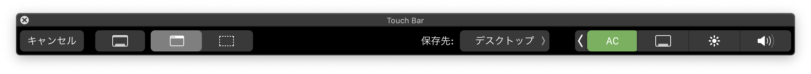
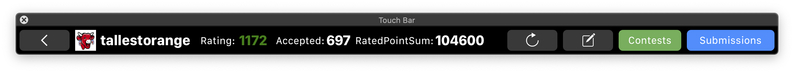
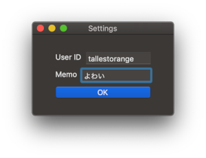
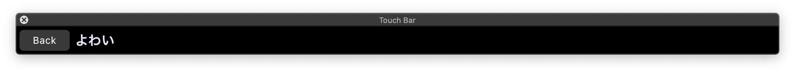
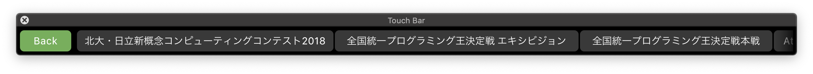
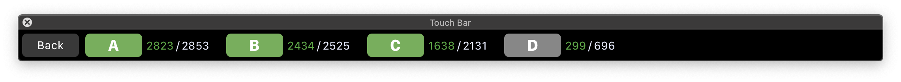
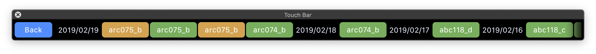

# ACTouchBar

## これはなに？

[AtCoder](https://atcoder.jp/)の精進をするのに役立つ(かもしれない) TouchBarアプリです

## 機能紹介

おおまかに分けて4つの機能があります

- コンテストでの正解者数/提出者数を確認する
- これまでのSubmissionを確認する
- メモを残す
- レートやこれまでに解いた問題数を確認する

## 画面紹介

起動時はこんな感じでControlStrip部分にアイコンが置かれます。
PrivateAPIを使用しているため**どのWindowがActiveであっても表に表示したまま**です~~すごいでしょ~~

『AC』ボタンを押すと以下のメイン画面に遷移します。
それぞれのボタンについては左から、

- 『戻る』ボタン
- 『情報更新』ボタン
- 『メモ確認』ボタン
- 『コンテスト一覧』ボタン
- 『直近の提出状況確認(100件分)』ボタン

となっています。

ユーザ名やメモに残したい文言は別ウィンドウの設定画面で設定が可能です

『メモ確認』画面はこんな感じです。~~正直やっつけ感が否めないです~~

『コンテスト一覧』画面はこんな感じです。コンテスト中にAC出来た問題についてはAC色に塗られる仕様です。

『直近の提出状況確認(100件分)』画面はこんな感じです。

## おわりに

不明点・機能追加希望については[@tallestorange](https://twitter.com/tallestorange)にリプライ等していただけると助かります